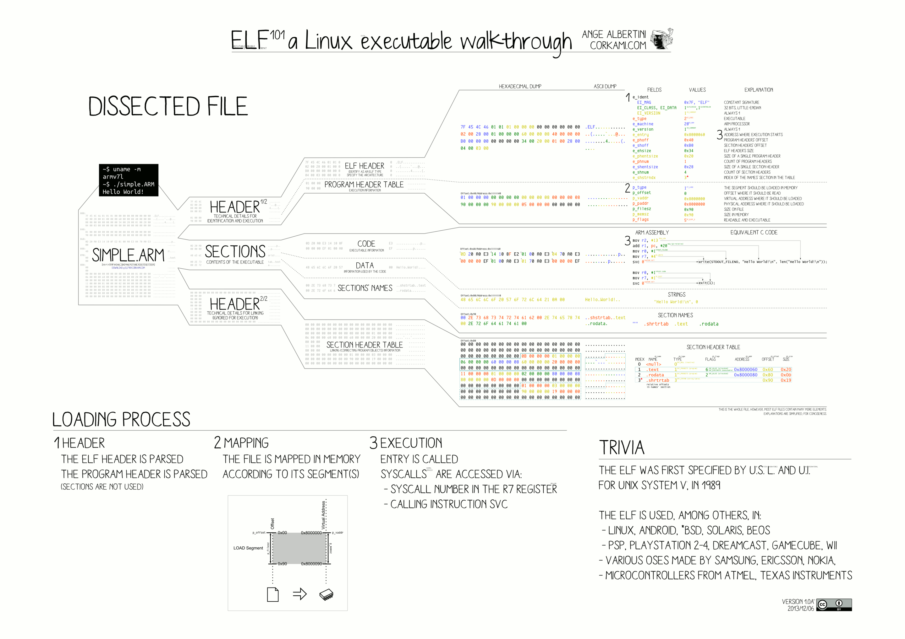
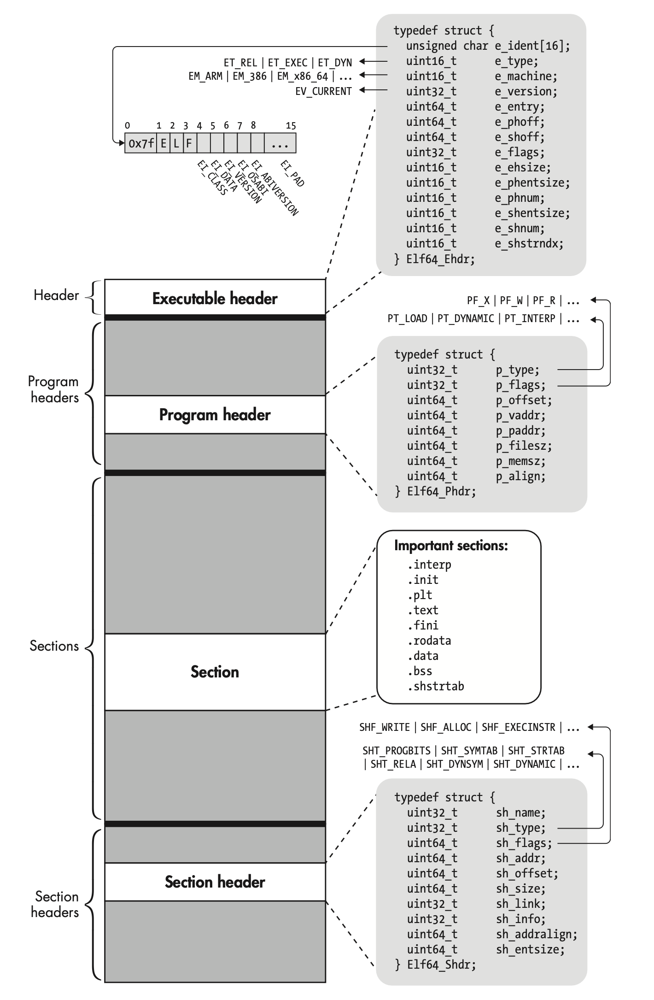

# Understanding ELF and Its Role in Process Creation

## Why

## Overview






Executable Linkable Format

| **ELF File Type** | **Example** | **Comment** |
| --- | --- | --- |
| Relocatable File | .o |  |
| Executable File | /bin/bash | Can be executed directly; no extension name required. |
| Shared Object File | .so |  |
| Core Dump File | core dump |  |

## Structure

### ELF Header

For any binary file (or object file), we can easily obtain its ELF Header using the `readelf` command:

```bash
readelf -h /bin/ls

ELF Header:
  Magic:   7f 45 4c 46 02 01 01 00 00 00 00 00 00 00 00 00
  Class:                             ELF64
  Data:                              2's complement, little endian
  Version:                           1 (current)
  OS/ABI:                            UNIX - System V
  ABI Version:                       0
  Type:                              DYN (Position-Independent Executable file)
  Machine:                           Advanced Micro Devices X86-64
  Version:                           0x1
  Entry point address:               0x6aa0
  Start of program headers:          64 (bytes into file)
  Start of section headers:          136232 (bytes into file)
  Flags:                             0x0
  Size of this header:               64 (bytes)
  Size of program headers:           56 (bytes)
  Number of program headers:         13
  Size of section headers:           64 (bytes)
  Number of section headers:         31
  Section header string table index: 30
```

The ELF Header ensures that the operating system can correctly read and interpret the object file.

```c

  typedef struct {
      unsigned char       e_ident[EI_NIDENT];
      Elf32_Half          e_type;
      Elf32_Half          e_machine;
      Elf32_Word          e_version;
      Elf32_Addr          e_entry;
      Elf32_Off           e_phoff;
      Elf32_Off           e_shoff;
      Elf32_Word          e_flags;
      Elf32_Half          e_ehsize;
      Elf32_Half          e_phentsize;
      Elf32_Half          e_phnum;
      Elf32_Half          e_shentsize;
      Elf32_Half          e_shnum;
      Elf32_Half          e_shstrndx;
  } Elf32_Ehdr;
```

### Example

source code:

```c
#include <stdio.h>
int main() {
  printf("Hello, world.\n");
}
```

compile:

```sh
gcc hello.c
```

run:

```sh
./a.out

Hello, world.
```

check <ELF> file header

```sh
file a.out

a.out: ELF 64-bit LSB pie executable, x86-64, version 1 (SYSV), dynamically linked, interpreter /lib64/ld-linux-x86-64.so.2, BuildID[sha1]=507c7b03924effefd99309b49fb32be700d2036f, for GNU/Linux 3.2.0, not stripped
```

hexdump frist 5 lines:

```sh
xxd -g 1 a.out | head -5

00000000: 7f 45 4c 46 02 01 01 00 00 00 00 00 00 00 00 00  .ELF............
00000010: 03 00 3e 00 01 00 00 00 60 10 00 00 00 00 00 00  ..>.....`.......
00000020: 40 00 00 00 00 00 00 00 90 36 00 00 00 00 00 00  @........6......
00000030: 00 00 00 00 40 00 38 00 0d 00 40 00 1f 00 1e 00  ....@.8...@.....
00000040: 06 00 00 00 04 00 00 00 40 00 00 00 00 00 00 00  ........@.......
```

hexdump in plain hexdump style:

```sh
xxd -p a.out > hello.dmp
```

see dump file here: [hello.dmp](elf/hello.dmp)

notice that the unicode for "Hello" is 48 65 6c 6c 6f, and the unicode for "Heloo" is 48 65 6c 6f 6f, so if we replace 48656c6c6f with 48656c6f6f in file hello.dmp, to get file [heloo.dmp](./elf/heloo.dmp), and reserve it back to binary file by running:

```sh
xxd -p -r heloo.dmp > heloo.out
```

run it:

```sh
./heloo.out

Heloo, world.
```

### Explanation

```c
# >>>>>>>>>>>>> ELF FILE HEADER <<<<<<<<<<<<< 
                # All numbers (except in names) are in base sixteen (hexadecimal)
                # 00 <- number of bytes listed so far
7F 45 4C 46     # 04 e_ident[EI_MAG]: ELF magic number
01              # 05 e_ident[EI_CLASS]: 1: 32-bit, 2: 64-bit
   01           # 06 e_ident[EI_DATA]: 1: little-endian, 2: big-endian
      01        # 07 e_ident[EI_VERSION]: ELF header version; must be 1
         00     # 08 e_ident[EI_OSABI]: Target OS ABI; should be 0

00              # 09 e_ident[EI_ABIVERSION]: ABI version; 0 is ok for Linux
   00 00 00     # 0C e_ident[EI_PAD]: unused, should be 0
00 00 00 00     # 10

02 00           # 12 e_type: object file type; 2: executable
      03 00     # 14 e_machine: instruction set architecture; 3: x86, 3E: amd64
01 00 00 00     # 18 e_version: ELF identification version; must be 1

54 80 04 08     # 1C e_entry: memory address of entry point (where process starts)
34 00 00 00     # 20 e_phoff: file offset where program headers begin

00 00 00 00     # 24 e_shoff: file offset where section headers begin
00 00 00 00     # 28 e_flags: 0 for x86

34 00           # 2A e_ehsize: size of this header (34: 32-bit, 40: 64-bit)
      20 00     # 2C e_phentsize: size of each program header (20: 32-bit, 38: 64-bit)
01 00           # 2E e_phnum: #program headers
      28 00     # 30 e_shentsize: size of each section header (28: 32-bit, 40: 64-bit)

00 00           # 32 e_shnum: #section headers
      00 00     # 34 e_shstrndx: index of section header containing section names

# >>>>>>>>>>>>> ELF PROGRAM HEADER <<<<<<<<<<<<< 

01 00 00 00     # 38 p_type: segment type; 1: loadable

54 00 00 00     # 3C p_offset: file offset where segment begins
54 80 04 08     # 40 p_vaddr: virtual address of segment in memory (x86: 08048054)
    
00 00 00 00     # 44 p_paddr: physical address of segment, unspecified by 386 supplement
0C 00 00 00     # 48 p_filesz: size in bytes of the segment in the file image ############

0C 00 00 00     # 4C p_memsz: size in bytes of the segment in memory; p_filesz <= p_memsz
05 00 00 00     # 50 p_flags: segment-dependent flags (1: X, 2: W, 4: R)

00 10 00 00     # 54 p_align: 1000 for x86

# >>>>>>>>>>>>> PROGRAM SEGMENT <<<<<<<<<<<<< 

B8 01 00 00 00  # 59 eax <- 1 (exit)
BB 00 00 00 00  # 5E ebx <- 0 (param)
CD 80           # 60 syscall >> int 80
```


### File data

**Program headers**

**ELF sections**

## Process Creation

### Overview

1. Create an isolated virtual address space.
2. Read the ELF header and establish a mapping between the virtual address space and the executable file. (VMA: Virtual Memory Area. One VMA corresponds to one Segment, while one Segment may contain multiple Sections to prevent fragmentation.)
3. Set the Program Counter (PC) to the entry point address specified in the ELF header.
4. Note: At this point, no actual .text or .data sections have been loaded into memory.
5. Page Fault: When the CPU attempts to execute the instruction pointed to by the Program Counter (PC), it finds that the virtual address is empty. This triggers a Page Fault, prompting the Operating System (OS) to set up a Virtual Memory Area (VMA) and load the necessary .text and .data sections as defined in the Executable and Linkable Format (ELF) file.

# Reference

https://linux-audit.com/elf-binaries-on-linux-understanding-and-analysis/

https://www.muppetlabs.com/~breadbox/software/ELF.txt

https://www.youtube.com/watch?v=nC1U1LJQL8o

https://www.youtube.com/watch?v=XH6jDiKxod8&list=PLZCIHSjpQ12woLj0sjsnqDH8yVuXwTy3p
