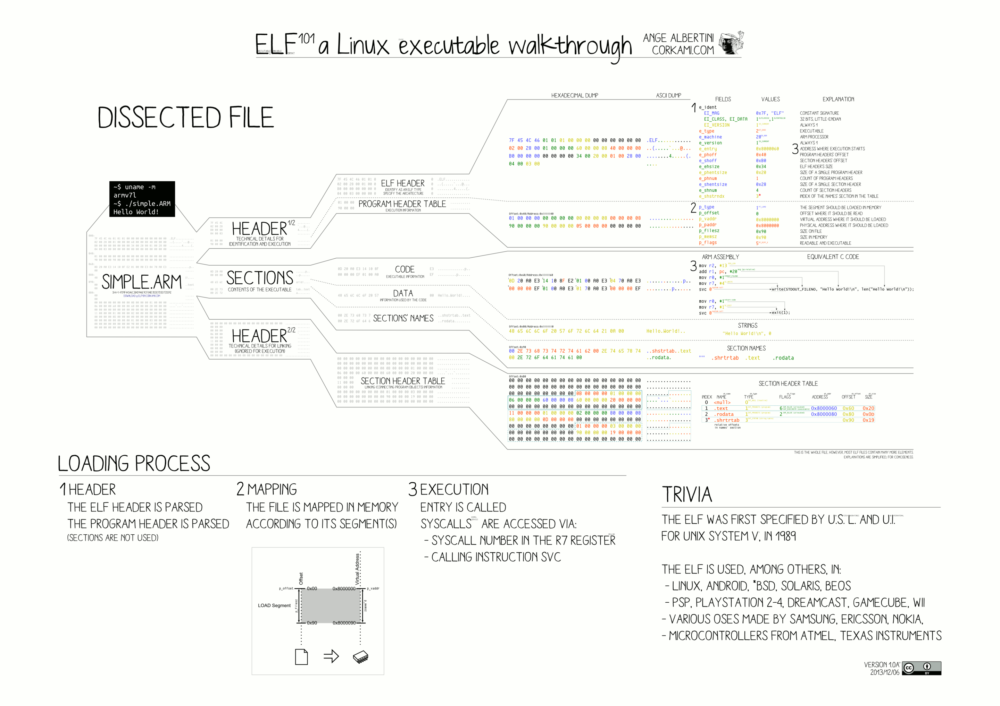

# Understanding ELF and Its Role in Process Creation

## Why

## Overview



Executable Linkable Format

| **ELF File Type** | **Example** | **Comment** |
| --- | --- | --- |
| Relocatable File | .o |  |
| Executable File | /bin/bash | Can be executed directly; no extension name required. |
| Shared Object File | .so |  |
| Core Dump File | core dump |  |

## Structure

### ELF Header

For any binary file (or object file), we can easily obtain its ELF Header using the `readelf` command:

```bash
readelf -h /bin/ls

ELF Header:
  Magic:   7f 45 4c 46 02 01 01 00 00 00 00 00 00 00 00 00
  Class:                             ELF64
  Data:                              2's complement, little endian
  Version:                           1 (current)
  OS/ABI:                            UNIX - System V
  ABI Version:                       0
  Type:                              DYN (Position-Independent Executable file)
  Machine:                           Advanced Micro Devices X86-64
  Version:                           0x1
  Entry point address:               0x6aa0
  Start of program headers:          64 (bytes into file)
  Start of section headers:          136232 (bytes into file)
  Flags:                             0x0
  Size of this header:               64 (bytes)
  Size of program headers:           56 (bytes)
  Number of program headers:         13
  Size of section headers:           64 (bytes)
  Number of section headers:         31
  Section header string table index: 30
```

The ELF Header ensures that the operating system can correctly read and interpret the object file.

```c

  typedef struct {
      unsigned char       e_ident[EI_NIDENT];
      Elf32_Half          e_type;
      Elf32_Half          e_machine;
      Elf32_Word          e_version;
      Elf32_Addr          e_entry;
      Elf32_Off           e_phoff;
      Elf32_Off           e_shoff;
      Elf32_Word          e_flags;
      Elf32_Half          e_ehsize;
      Elf32_Half          e_phentsize;
      Elf32_Half          e_phnum;
      Elf32_Half          e_shentsize;
      Elf32_Half          e_shnum;
      Elf32_Half          e_shstrndx;
  } Elf32_Ehdr;
```

**Magic**
`e_ident`

The prefix starts with 7F, which is a standard identifier for ELF files. The succeeding three bytes are 45, 4C, and 46, which represent the ASCII codes for "E", "L", and "F" respectively.

**Class**

Determines the architecture for the file. More accurately, it specifies the word size of the CPU/ISA: either 32-bit or 64-bit.

**Data**

Specifies the endianness for the rest of the file. It can be either little-endian or big-endian. For a quick explanation of endianness (also known as byte order), refer to this document: https://developer.mozilla.org/en-US/docs/Glossary/Endianness

**Version**
`e_version`

More or less it is hardcoded to 1.

| **Name** | **Value** | **Meaning** |
| --- | --- | --- |
| `EV_NONE` | 0 | Invalid version |
| `EV_CURRENT` | 1 | Current version |

**OS/ABI**

The operating system ABI version.

> The ABI is very similar to an API, or it represents the compiled version of an API.
> 

https://en.wikipedia.org/wiki/Application_binary_interface

**ABI Version**

**Machine**

**Type**
This member identifies the object file type.

| **Name** | **Value** | **Meaning** |
| --- | --- | --- |
| `ET_NONE` | 0 | No file type |
| `ET_REL` | 1 | Relocatable file |
| `ET_EXEC` | 2 | Executable file |
| `ET_DYN` | 3 | Shared object file |
| `ET_CORE` | 4 | Core file |
| `ET_LOPROC` | 0xff00 |  Processor-specific |
| `ET_HIPROC` | 0xffff |  Processor-specific |

### File data

**Program headers**

**ELF sections**

## Process Creation

### Overview

1. Create an isolated virtual address space.
2. Read the ELF header and establish a mapping between the virtual address space and the executable file. (VMA: Virtual Memory Area. One VMA corresponds to one Segment, while one Segment may contain multiple Sections to prevent fragmentation.)
3. Set the Program Counter (PC) to the entry point address specified in the ELF header.
4. Note: At this point, no actual .text or .data sections have been loaded into memory.
5. Page Fault: When the CPU attempts to execute the instruction pointed to by the Program Counter (PC), it finds that the virtual address is empty. This triggers a Page Fault, prompting the Operating System (OS) to set up a Virtual Memory Area (VMA) and load the necessary .text and .data sections as defined in the Executable and Linkable Format (ELF) file.

# Reference

https://linux-audit.com/elf-binaries-on-linux-understanding-and-analysis/

https://www.muppetlabs.com/~breadbox/software/ELF.txt

https://www.youtube.com/watch?v=nC1U1LJQL8o
